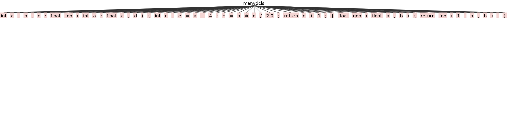

# Syntax Analysis

## Content
1. Introduction
2. Context-free grammar
3. Write a grammar
4. Some issues

## How to test **grammar** using **grun**

1. Step 1: Exporting classpath of the jar and creating alias
```bash
# Exporting classpath of the jar and creating alias
$ export CLASSPATH=".:path_to/antlr-*-complete.jar:$CLASSPATH"
$ alias antlr4='java -Xmx500M -cp "path_to/antlr-*-complete.jar:$CLASSPATH" org.antlr.v4.Tool'
$ alias grun='java org.antlr.v4.runtime.misc.TestRig'
```
2. Step 2: Testing if jar is accessible or not
```bash
$ java org.antlr.v4.Tool
# or
$ java -jar path_to/antlr-*-complete.jar
# or
$ antlr4
```

If it shows:
```bash
ANTLR Parser Generator Version 4.7
so on ...
```
then it was successful

3. Step 3: Running the antlr tool on file
```bash
$ antlr4 MC.g4 
```
It will auto generate files *.tokens *.java

4. Step 4: Compile all the java files by
```bash
$ javac MC*.java
```

5. Step 5: Draw parser tree by following command:
```bash
$ grun MC program -f path_to/test.txt -gui
```

Now, we have the **parse tree** as shown below


